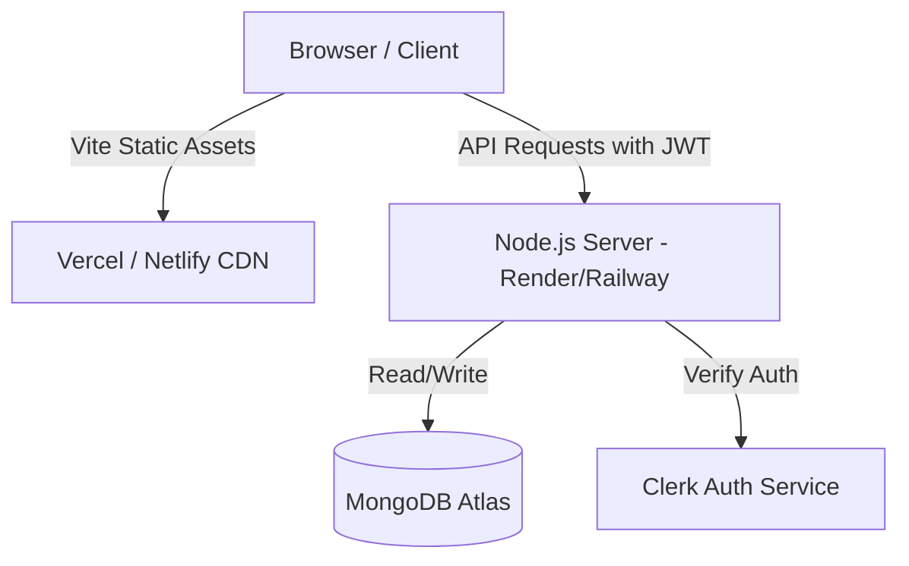

# 🚀 Deployment Guide: Personal Finance Tracker

This guide details how to deploy the **Personal Finance Tracker** project to production.

The application is structured as a decoupled monorepo:
*   **Backend (`/server`):** Node.js & Express REST API with Mongoose (MongoDB) and Clerk Authentication.
*   **Frontend (`/client`):** React SPA built with Vite, TailwindCSS, and TanStack Query.

---

## 🛠️ Prerequisites

Before deploying, make sure you have:
1.  **MongoDB Atlas Database:** A running MongoDB Atlas cluster.
2.  **Clerk Account:** An active Clerk dashboard with a project created.
3.  **Git Repository:** The code pushed to a Git provider (e.g., GitHub, GitLab).

---

## ⚡ Option 1: Decoupled Deployment (Recommended)

This is the standard and most performant architecture for modern web applications. The frontend is deployed to a Global Edge CDN (e.g., Vercel/Netlify), and the backend runs on a dedicated Node.js service (e.g., Render/Railway).



### 1. Backend Deployment (Render Example)
1.  Sign in to [Render](https://render.com/).
2.  Click **New +** and select **Web Service**.
3.  Connect your GitHub repository.
4.  Configure the service details:
    *   **Name:** `personal-finance-tracker-api`
    *   **Region:** Select the region closest to your MongoDB database/users.
    *   **Branch:** `main`
    *   **Root Directory:** `server`
    *   **Runtime:** `Node`
    *   **Build Command:** `npm install`
    *   **Start Command:** `npm start`
5.  Add the environment variables in the **Environment** tab (see [Environment Variables Checklist](#-environment-variables-checklist)).

### 2. Frontend Deployment (Vercel Example)
1.  Sign in to [Vercel](https://vercel.com/).
2.  Click **Add New** > **Project** and import your repository.
3.  Configure the project details:
    *   **Framework Preset:** `Vite`
    *   **Root Directory:** `client`
    *   **Build Command:** `npm run build`
    *   **Output Directory:** `dist`
4.  Expand the **Environment Variables** section and add client variables (see [Environment Variables Checklist](#-environment-variables-checklist)).
5.  Click **Deploy**.

---

## 📦 Option 2: Unified Monolith Deployment (Single Service)

If you prefer to deploy everything as a single service to save costs, you can configure your Express backend to serve the compiled frontend static files.

### 1. Code Adjustments
To support serving the frontend from the Express app, we would configure `server/app.js` to serve static assets from the React build folder when in production.

Add the following to the bottom of `server/app.js` (just before the error handlers):

```javascript
import path from 'path';
import { fileURLToPath } from 'url';

const __filename = fileURLToPath(import.meta.url);
const __dirname = path.dirname(__filename);

// Serve static assets in production
if (process.env.NODE_ENV === 'production') {
  app.use(express.static(path.join(__dirname, '../../client/dist')));
  
  app.get('*', (req, res) => {
    res.sendFile(path.resolve(__dirname, '../../client', 'dist', 'index.html'));
  });
}
```

### 2. Root Build Script Update
To build both applications in a single run, update the root `package.json` to install, build, and run together:
```json
"scripts": {
  "build": "npm run install:all && npm run build --prefix client",
  "start": "npm start --prefix server"
}
```

### 3. Deploying the Unified Service (Render/Railway)
Configure a single web service:
*   **Root Directory:** *Leave empty (use root)*
*   **Build Command:** `npm run build`
*   **Start Command:** `npm start`
*   **Environment Variables:** Provide all environment variables from both the frontend and backend in this single service configuration (remembering that Vite will build using standard client variables).

---

## 🔑 Environment Variables Checklist

Ensure these variables are correctly set in the environment settings of your hosting platforms:

### Backend Environments (`server`)
| Variable Name | Description | Value |
| :--- | :--- | :--- |
| `MONGODB_URI` | Connection URI for MongoDB | `mongodb+srv://...` |
| `CLERK_SECRET_KEY` | Secret Key from Clerk Dashboard | `sk_test_...` (or `sk_live_...` in prod) |
| `CLIENT_URL` | The public URL of the deployed frontend | e.g. `https://your-app.vercel.app` (No trailing slash) |
| `PORT` | Running port for node | `5000` (Render/Railway inject this dynamically) |
| `NODE_ENV` | Running mode | `production` |

### Frontend Environments (`client`)
| Variable Name | Description | Value |
| :--- | :--- | :--- |
| `VITE_CLERK_PUBLISHABLE_KEY` | Publishable Key from Clerk Dashboard | `pk_test_...` (or `pk_live_...` in prod) |
| `VITE_API_URL` | The public API URL of the backend service | e.g. `https://personal-finance-tracker-api.onrender.com` |

---

## 🔒 Clerk Dashboard Production Configuration

Since Clerk is handling authentication, you must update its settings for your production domain:

1.  Navigate to the [Clerk Dashboard](https://dashboard.clerk.com/).
2.  Switch to your production instance (if using live credentials) or configure your development instance testing domains.
3.  Go to **Paths** under **Settings** and update:
    *   **Application Homepage:** Your deployed frontend URL.
4.  Configure **Allowed Redirect URLs** and **CORS Origins** to allow requests from your newly deployed frontend domain.
